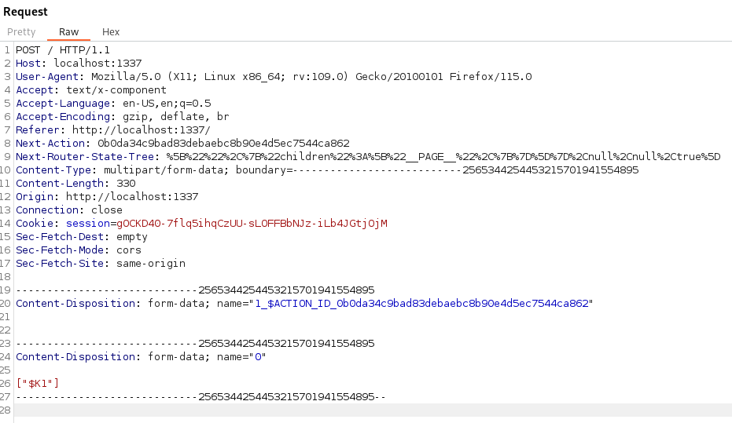

# DoxPit HTB challenge WRITEUP
[Exploit.py](exploit.py) Made by: [Gianlush](https://github.com/Gianlush/), [simonecris](https://github.com/simonecris)

## step 1: ricerca vulnerabilità
Avviando il docker si nota subito la presenza di un secondo servizio web esposto sulla porta 3000, che fa intuire che sia necessario un qualche tipo di SSRF per accederci tramite l'unico servizio esposto. L'unico endpoint in cui è possibile inserire dell'input non consente alcun tipo di injection. Cercando online la versione di NextJS usata è possibile trovare la PoC per una [CVE](https://github.com/azu/nextjs-CVE-2024-34351) molto utile. Le condizioni per il funzionamento sono tutte soddisfate:
- [NextJS version](DoxPit/challenge/front-end/package.json) <= 14.1.1.
- Utilizzo delle Server Actions (visibile anche quando si clicca su uno qualsiasi dei paste, il che genera una richiesta post).
- [Redirezione](DoxPit/challenge/front-end/app/serverActions.tsx) verso un path che inzia per `/`.



## step 2: preparazione attacco

Sfruttando il codice server della PoC (tradotto da ChatGPT in JS per semplicità), ed inviando una POST definita come dalla CVE alla Web challenge, viene forzato il servizio a rispondere con una richiesta HEAD che viene intercetta dal server js malevolo per forzare una redirezione a localhost permettendoci di accedere al secondo servizio della challenge.


Si può usare un tool come ngrok per esporre questo server, ed usare l'hostname ottenuto come header Origin e Host nella richiesta POST:


```bash
ngrok tcp 80
```

```bash
node server.js
```
```bash
curl 'http://localhost:1337/' \
  -H 'Host: 5.tcp.eu.ngrok.io:17810' \
  -H 'Accept: text/x-component' \
  -H 'Accept-Language: ja,en-US;q=0.9,en;q=0.8' \
  -H 'Cache-Control: no-cache' \
  -H 'Connection: keep-alive' \
  -H 'Content-Type: text/plain;charset=UTF-8' \
  -H 'Next-Action: 0b0da34c9bad83debaebc8b90e4d5ec7544ca862' \
  -H 'Next-Router-State-Tree: %5B%22%22%2C%7B%22children%22%3A%5B%22__PAGE__%22%2C%7B%7D%5D%7D%2Cnull%2Cnull%2Ctrue%5D' \
  -H 'Origin: http://5.tcp.eu.ngrok.io:17810' \
  -H 'Pragma: no-cache' \
  -H 'Referer: http://localhost:1337/' \
  -H 'Sec-Fetch-Dest: empty' \
  -H 'Sec-Fetch-Mode: cors' \
  -H 'Sec-Fetch-Site: same-origin' \
  -H 'User-Agent: Mozilla/5.0 (Macintosh; Intel Mac OS X 10_15_7) AppleWebKit/537.36 (KHTML, like Gecko) Chrome/126.0.0.0 Safari/537.36' \
  -H 'sec-ch-ua: "Not/A)Brand";v="8", "Chromium";v="126", "Google Chrome";v="126"' \
  -H 'sec-ch-ua-mobile: ?0' \
  -H 'sec-ch-ua-platform: "macOS"' \
  --data-raw '[]'
  ```

La registrazione va a buon fine, il che significa che si può effettivamente raggiungere il servizio:


## step 3: ricerca vulnerabilità secondo servizio

A questo punto serve studiare il secondo servizio per individuare dei punti di attacco. Per comodità è stato modificato il docker della challenge per esporre anche la porta 3000 così da poter testare eventuali payload più facilmente.

La homepage consente di fare una scansione del filesystem, che potrebbe risultare utile dato che la flag viene scritta su un file con un nome randomico, tuttavia la scansione della directory `/` non restiuisce risposta, probabilmente a causa del timeout e della durata della scansione dell'intero filesystem. Sia `register` che `login` che non presentano possibilità di injection, e la scansione utilizza il parametro `directory` e lo inserisce nel template della pagina risultato. Sono presenti dei check sui char presenti nel valore directory il che fa pensare che si voglia impedire una **SSTI**.

Abbiamo cercato online e testato dei possibili SSTI payload per jinja2 e siamo stati fortunati. Utilizzando il seguente payload trovato su [github](https://github.com/HackTricks-wiki/hacktricks/blob/master/pentesting-web/ssti-server-side-template-injection/jinja2-ssti.md) abbiamo avuto la conferma che la Template Injection fosse possibile:

`<pre>   <script> alert('There is SSTI here') </script>      </pre>`


## step 4: bypass blacklist
Purtroppo il filtro applicato è molto restrigente, infatti anche i payload che si trovano online che tengono conto di alcuni char bloccati quali  `{{` `}}` `.` `_` `[` `]` non funzionano poichè fanno utilizzo di altri char in blacklist come `x` o `\`.

Ad esempio, è possibile trovare su [HackTricks](https://book.hacktricks.xyz/pentesting-web/ssti-server-side-template-injection/jinja2-ssti#without-several-chars) il seguente payload, che sebbene non sia funzionamente, apre un ottimo spunto che sta nell'utilizzo dei filtri del template per estrarre i parametri dalla richiesta stessa, come gli argomenti del'url, o un particolare header. Infatti, su di essi non viene fatto il check di sicurezza perciò è possibile inserirci anche caratteri non desiderati.

``

Qui si tentava di encodare il `_` con `\x5f` che per il nostro problema non è fattibile, tuttavia l'utilizzo di `request|attr()` ci ha portato a studiare più a fondo questi filtri e così abbiamo scoperto che è possibile usarli, appunto, per estrarre dati dagli argomenti del'url, come indicato anche su questo [sito](https://ctf.zeyu2001.com/2022/securinets-ctf-finals-2022/strong).

Per applicare questo exploit è sufficiente aggiungere nel'url l'argomento `&__=a` come primo argomento, in modo da fargli riferimento con il filtro `first` e poi sostituire ogni occorrenza del `_` con `underscore = request|attr('args')|list|first`, anche se con qualche accortenza aggiuntiva, infatti è necessario usare questo formato: `((underscore, 'globals', underscore)|join)` così da unire il tutto in un'unica stringa.

A questo punto è possibile formare il payload finale:

`/home?__=a&directory=`


## step 5: passo indietro; autenticazione

Non resterebbe altro che mettere insieme tutte le cose viste finora, cioè avviare il server js che ci reindirizzi alla pagine di registrazione, successivamente modificare il server perchè ci reindirizzi alla pagina di login ed infine alla pagina home dove iniettare il payload. Il problema sta però nel fatto che poichè si tratta di un banale redirect, il nostro server js non è in grado di mantenere traccia del cookie generato. Fortunamente si può sfruttare un'altra debolezza del codice, cioè il fatto che l'endpoint `home` è protetto dal `auth_middleware` il quale, se non trova una sessione già stabilità, verifica se nel url è presente l'argomento `token` e se tale token sia valido. Grazie al metodo register siamo in grado di ottenere un token valido e quindi proseguire nell'attacco che sarà dunque eseguito in 2 fasi:

### fase 1: registrazione utente

Qui si può fare riferimento allo [step 2](#step-2-preparazione-attacco), durante il quale abbiamo individuato il `token: d94a1bb48312d981370ae62116c3ab28` che possiamo usare nella fase successiva.

### fase 2: recuperare la flag

Per farlo, il comando da iniettare è banale: `cat /flag*`, che funziona anche non sapendo il nome completo della flag:

