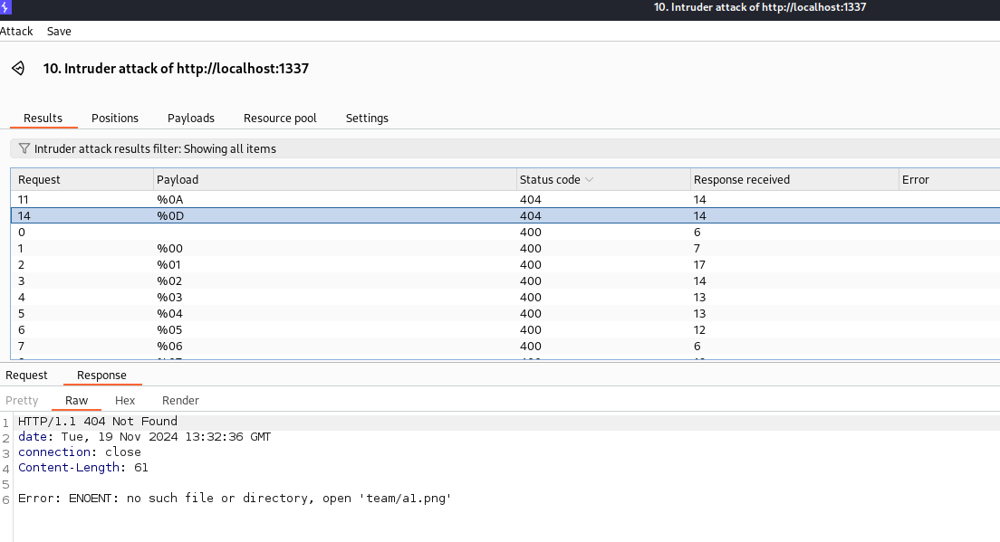
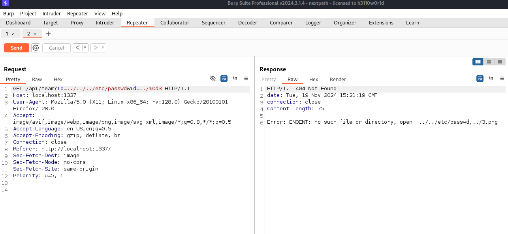
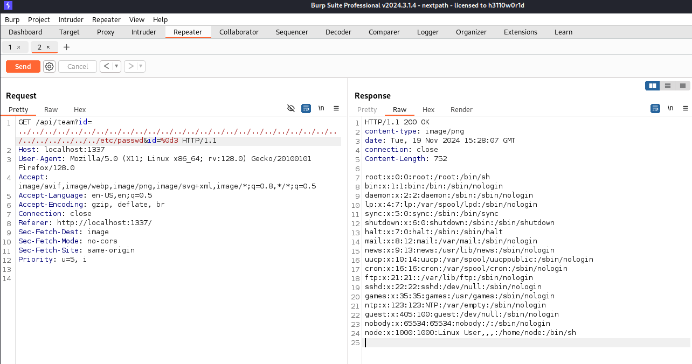
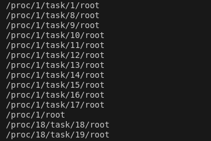
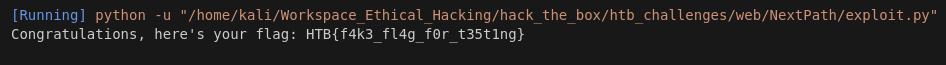

# NextPath HTB challenge WRITEUP
[Exploit.py](exploit.py) Made by: [Gianlush](https://github.com/Gianlush/)

## step 1: regex bypass
La challenge presenta una solo API `/api/team` configurata per impedire di eseguire il path traversal attraverso una REGEX del tipo:
```js
const ID_REGEX = /^[0-9]+$/m;
```
Non sono riuscito a trovare nulla nello specifico su tecniche di bypass regex, quindi ho provato a fare fuzzing con una lista di Control Charcter quali: `%00
%01 %02 %03 %04 %05 %06 %07 %08 %09 %0A %0B %0C %0D %0E %0F %7F`. In particolare, usando la lista precedente come payload, ho avviato il seguente attacco tramite l'intruder Burp:

```js
GET /api/team?id=a§FUZZ§1 HTTP/1.1
```


E ordinando per Status Code, si nota una risultato diverso per i char `%0D` e `%0A`, i quali consentono di inserire anche caratteri non numerici (normalmente proibito dalla regex).
## step 2: filter bypass
Rimane il problema di non poter inserire le stringhe `..` o `/`. Questo problema però si risolve facilmente con le classiche tecniche di web-pentest su api. In particolare **parameter pollution**, cioè replicare il parametro `id` in questo caso trasforma la variabile `query.id` in un array sul quale fallisce il check: 
```js
if (query.id.includes("/") || query.id.includes("..")) 
```
consentendo di effettuare **Path Traversal**:



## step 3: bypass slicing

L'ultimo ostacolo è dato dal fatto che il path finale è creato tramite un metodo `join()`:

```js
const filepath = path.join("team", query.id + ".png");
const content = fs.readFileSync(filepath.slice(0, 100));
```
il che fa si che al nostro payload vengano appesi dei caratteri non voluti. Fortunamente, come si può leggere dal codice, solo i primi 100 caratteri vengono effettivamente inseriti nel path, perciò allungando artificialmente il payload è possibile tagliare fuori gli ultimi caratteri:

Ora, provando a mettere tutto insieme per leggere il file `/flag.txt` ci si accorge che la sequenza di `../` e `/flag.txt` non si somma per arrivare ad una lunghezza di 100 caratteri, rendendo impossibile la costruzione del path voluto.

Provando ad inserire alcuni `./` al posto di qualche `../` non si nota alcuna differenza. Indagando ulteriormente sulla funzione `path.join()` si scopre che quest'ultima effettua una sorta di ottimizzazione del path fornito in input, cioè risolve automaticamente percorsi del tipo `/etc/../passwd` in `/etc/passwd`, rendendo quindi la prima stringa lunga 11 caratteri anzichè 14.

In poche parole, tenendo anche in conto che il path inizia con `team/` + `../` il quale viene risolto in `.`, dobbiamo considerare 3 caratteri "extra" sul conto dei 100, e tenendo in conto la lunghezza di `flag.txt` si ha che `100 + 3 - len('flag.txt') = 95` è la lunghezza finale che il payload deve avere, che è quindi non realizzabile con sequenza di `../` poichè non divisibile per 3. Bisogna quindi trovare un modo per arrivare a `/` andando in "profondità" nel filesystem, ad esempio tramite dei link simbolici.

Cercando online si scopre che di default ne esistono parecchi e che è possibile individuare tramite comandi come: 

```python
find / -type l -lname / 2> /dev/null
```
che se eseguito direttamente sul docker della challenge da come risultato:



da cui si scopre che esiste un path come `/proc/1/root/` che ha una lunghezza totale di 13, che può essere combinata con la sequenza di `../` per raggiungere la lunghezza voluta. A tale scopo ho creato un semplice script in python che costruisce il payload finale in modo adatto:
```python
def genera_stringa(base_str, padding_str, totale_len=95):
    c = 1  # Iniziamo con almeno una stringa di lunghezza 13
    result = ""  # Stringa che costruiremo
    
    while True:
        # Calcoliamo la lunghezza residua
        remaining_length = totale_len - c * len(padding_str)
        
        # Se la lunghezza rimanente è divisibile per 3, possiamo riempirla con "../"
        if remaining_length % len(base_str) == 0:
            # Costruisci la stringa con c stringhe di lunghezza 13 e il resto con stringhe di lunghezza 3
            result = base_str * (remaining_length // 3) + padding_str * c
            break
        else:
            # Se non è divisibile per 3, incrementiamo c per provare a inserire più stringhe di lunghezza 13
            c += 1
    
    return result
```

che da come output: ```../../../../../../../../../../../../../../../../../../../../../../../proc/11/root/proc/11/root/ lunghezza: 95```

A questo punto, mettendo tutto insieme nel [exploit](./exploit.py), si riesce ad ottenere la flag.
